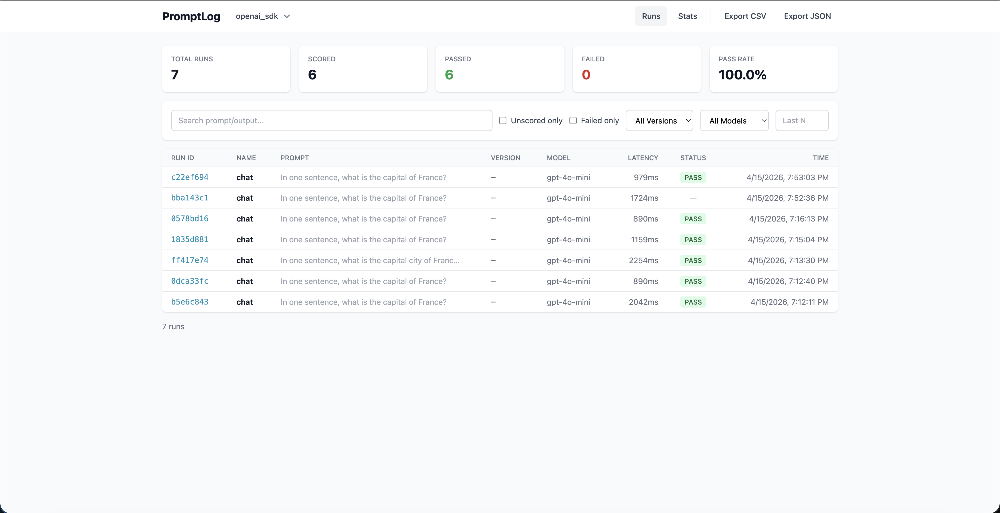
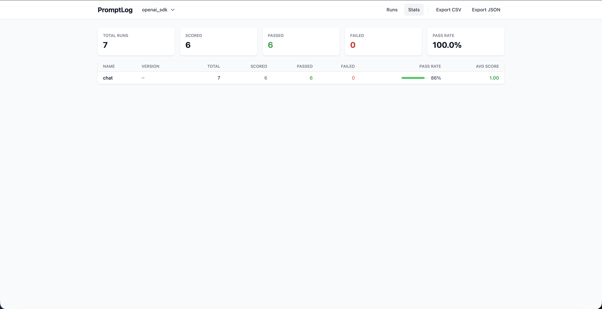
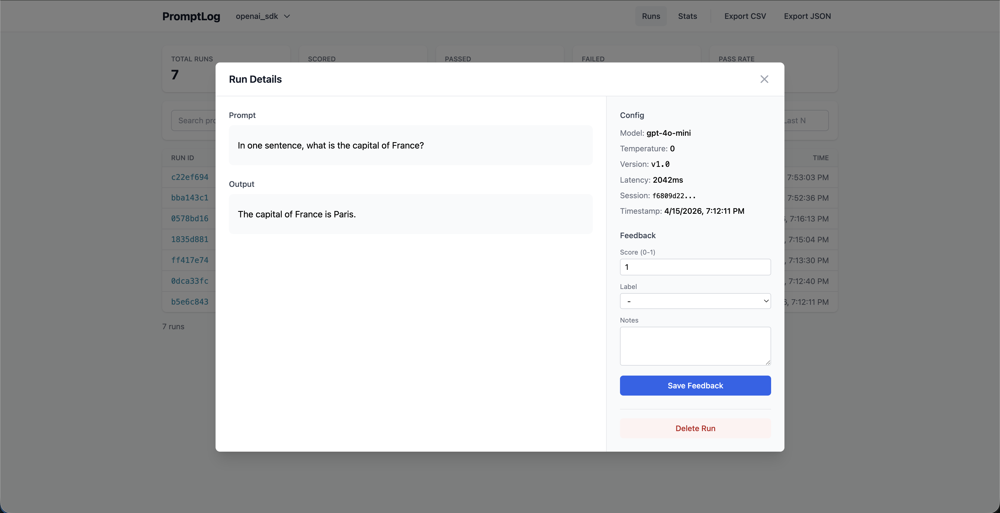

# PromptLog

**A lightweight, framework-agnostic prompt tracking library for LLM projects — automatic logging, versioning, and run comparison.**

[](https://www.python.org/)
[](LICENSE)
[]()

---

## What is PromptLog?

Building LLM apps means constantly tweaking prompts, swapping models, and eyeballing outputs — but with no record of what changed or why. PromptLog fixes that.

Add one decorator to any function that calls an LLM and every execution is automatically logged — prompt, output, latency, model config — to a local SQLite database. No cloud, no infra, no SDK changes. Then use the CLI or web dashboard to review outputs, score them, track prompt versions by content hash, and compare pass rates across iterations.

Works with **OpenAI, Anthropic, Gemini, LangChain, AutoGen**, or anything else that returns a string.

---

## Key Features

- **One decorator, full capture** — wrap any sync function with `@pl.track()` and get prompt, output, latency, and errors logged automatically
- **Prompt versioning** — `prompt_template` is auto-hashed (MD5, 8 chars) so you can group and compare runs by prompt version
- **Human feedback loop** — score runs interactively with `promptlog review` or non-interactively with `promptlog rescore`
- **Hierarchical run tracking** — nested `@pl.track` calls automatically form parent-child trees, visualized in the CLI and dashboard
- **Web dashboard** — browse runs, filter, score feedback, and export — launch with `promptlog serve`
- **Local-first SQLite** — no external service, data lives in `~/.promptlog/` or a local `.promptlog/` folder
- **Framework-agnostic** — works with OpenAI, Anthropic, Google Gemini, LangChain, AutoGen, or any Python function

---

## Installation

Clone the repository and install in editable mode:

```bash
git clone https://github.com/sujith-kamme/PromptLog.git
cd PromptLog
uv pip install -e ".[examples,ui]"
```

> **Requirements:** Python 3.11+ · SQLite (bundled with Python) · [uv](https://github.com/astral-sh/uv) (or use `pip install -e` directly)

---

## Quick Start

```python
import promptlog as pl
from openai import OpenAI

# 1. Initialize once
pl.init(project="my_app", feedback_mode="end")

client = OpenAI()

# 2. Decorate any function that calls an LLM
@pl.track(model="gpt-4o-mini", temperature=0.0)
def classify(review: str) -> str:
    pl.log_prompt(f"Classify sentiment: {review}")
    response = client.chat.completions.create(
        model="gpt-4o-mini",
        messages=[{"role": "user", "content": f"Classify sentiment: {review}"}],
    )
    return response.choices[0].message.content

# 3. Call normally — tracking is transparent
result = classify("The product was excellent!")
print(result)
```

Then inspect via CLI:

```bash
promptlog ls --project my_app
promptlog view <run_id> --project my_app
promptlog stats --project my_app
```

Or launch the web dashboard:

```bash
promptlog serve --project my_app
```

---

## Web Dashboard



Browse all runs with prompt preview, latency, model, and pass/fail status at a glance. Filter by version, model, or search across prompt/output text.



Aggregated metrics per (task, version) group — pass rate with inline bar, color-coded avg score.



Click any row to open the full run detail — prompt, output, model config, and an inline feedback form to score runs directly from the UI.

---

## Documentation

Full API reference, CLI reference, REST API docs, and integration examples are in the bundled docs:

→ **[View Documentation](promptlog/ui/static/docs.html)**

Or serve locally and open in your browser:

```bash
promptlog serve
# Open http://localhost:8000/static/docs.html
```

---

## Contributing

```bash
git clone https://github.com/sujith-kamme/PromptLog.git
cd PromptLog

# Install in editable mode with dev dependencies
uv pip install -e ".[examples,ui]"
```

Please open issues at [github.com/sujith-kamme/PromptLog/issues](https://github.com/sujith-kamme/PromptLog/issues).

---

## License

MIT — see [LICENSE](LICENSE).
